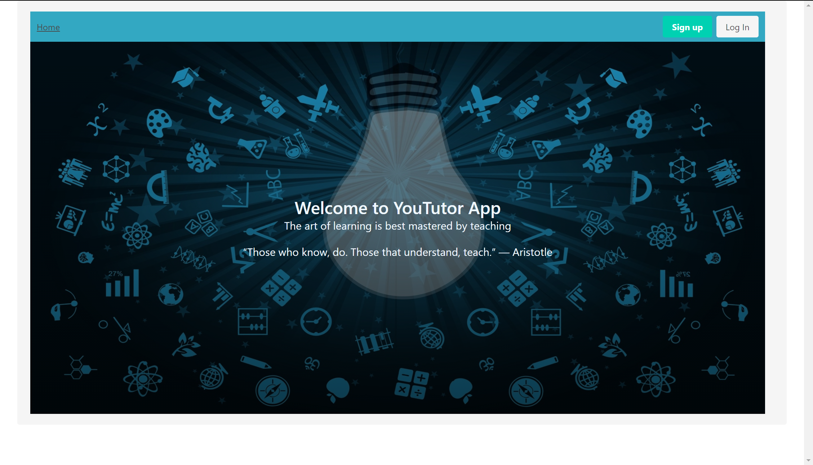

# [YouTUTOR](http://www.you-tutor.com/)
> This application is a student aid intented to enhance the learning experience by providing a platform where students can both seek help on a the subjects they have not mastered yet and offer help on those subjects on which they are confident. It is deployed on my own domain. 

## Table of contents
* [General-info](#General-info)
* [Screenshots](#screenshots)
* [Technologies](#technologies)
* [Setup](#setup)
* [Features](#features)
* [Status](#status)
* [Inspiration](#inspiration)
* [Contact](#contact)

## General-info:
This React application is disigned to create a simple, basic, and pleasantly joyful look which is quickly navigable. 

## Screenshots

## Technologies

* Built with Bulma for style: [Bulma](https://bulma.io/)

* additional source for style: [Reveal](https://www.react-reveal.com/)

* images from: [pixabay](https://pixabay.com/)

## Setup
To view this app you can click : [here](http://www.you-tutor.com/)

## Features
* feature 1: This app has the responsive ability, it can customize its sizes depending on changes to the screen. If viewed on mobile, it displays specificly designed react components so to offer a pleasant experience on smaller mobile screens. 
* feature 2: profile page...
* feature 3: responsive and functional components for profile.
* feature 4: React Reveal is used to add a sense of dynamism and playfullness.

To-do list:

* Homepage for mobile should be a badge perhaps...
* Add a section in homepage dedicated to the skills acquired...perhaps a new component matching the theme.
* definetly bypass the homepage component, move it in the app.js file...
* Update ReadMe when design is done.

## Status
YouTutor is: _in progress_, as there are more features to be added and the profile page must be improved.

## Inspiration
While going through coding bootcamp during a pandemic crisis, social interation between students was necessarily reduced. A social media app designed to make students interact and challange them to become teachers of what they just learned was the inspiration for this project.

## Contact
Email: notitiami@gmail.com

LinkedIn: [LinkedIn](https://www.linkedin.com/in/valerio-varani-635ba31a1/)

Feel free to contact me!
